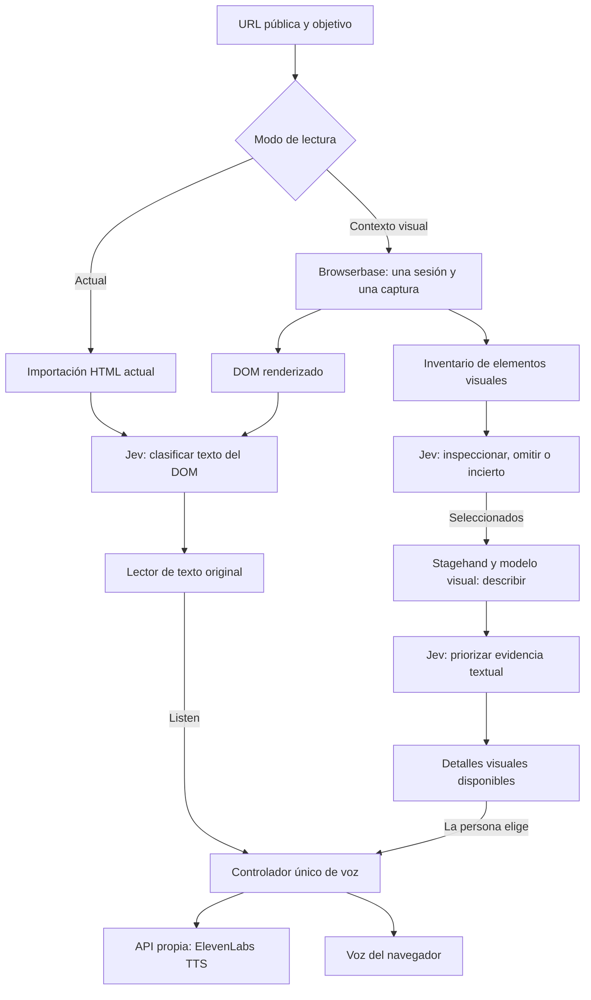

# Brailly: plan de integración visual y de voz

Fecha: 26 de septiembre de 2026. Base revisada: `main`, commit `bc6dd37`.

Estado: propuesta de implementación; Browserbase y ElevenLabs todavía no están integrados. Este documento no modifica el comportamiento de la aplicación.

## 1. Qué vamos a construir

Añadir un modo opcional **«Abrir con contexto visual»** para páginas públicas. Browserbase obtiene el DOM renderizado y detecta elementos visuales; Jev decide cuáles necesitan inspección; un modelo con visión los convierte en texto; Jev prioriza esa información. La persona puede abrir y escuchar las descripciones cuando quiera, conservando su posición en el texto original.

Añadir **ElevenLabs TTS** al botón Listen mediante un controlador de audio único, conservando la voz del navegador. El agente conversacional de ElevenLabs queda para una segunda etapa: no hace falta para leer el texto seleccionado.

El principio central es: **Jev decide; el modelo visual describe; ElevenLabs pronuncia; Brailly controla la lectura.** Jev recibe únicamente texto y devuelve decisiones tipadas. No le pediremos generar una descripción ni interpretar píxeles.

## 2. Punto de partida comprobado


| Parte actual                                   | Qué hace                                                                              | Consecuencia para la integración                                             |
| ---------------------------------------------- | ------------------------------------------------------------------------------------- | ---------------------------------------------------------------------------- |
| `src/main.tsx` → `src/App.tsx`                 | Monta el lector web actual                                                            | Integrar aquí mediante módulos pequeños                                      |
| `server/page.ts`                               | Importa HTML público, extrae texto y crea una preview sanitizada sin ejecutar scripts | Mantener como modo rápido por defecto                                        |
| `shared/dom.ts`                                | Extrae hasta 60 bloques de 800 caracteres; no describe imágenes ni canvas             | Añadir inventario visual separado                                            |
| `server/dom-jev.ts`                            | Score y Choice por bloque con Jev                                                     | Reutilizar el clasificador y su validación                                   |
| `extension/*`                                  | Captura el DOM renderizado de la pestaña real                                         | Mantener su captura textual; no mezclarla con otra sesión remota             |
| `src/App.tsx`                                  | Selección, ventanas de texto, simulador Braille y `speechSynthesis`                   | Preservar selección/offsets y extraer el control de voz                      |
| `api/index.ts` + `server/web-api.ts`           | API desplegada; Vercel configura 60 s por invocación                                  | Trabajo visual acotado dentro de una petición                                |
| `FlightLab.tsx`, `runtime.ts`, `server/jev.ts` | Laboratorio anterior de avisos de vuelos                                              | No están conectados al lector actual; no trasladar su scheduler en esta fase |


La documentación tiene diferencias: `Idea.md` describe una visión más amplia de interrupciones y viajes; `DEMO.md` todavía explica el laboratorio anterior. La implementación se basará en el App actual y actualizará la demo al terminar.

Baseline de esta revisión: `npm test` pasa **20/20** y `tsc --noEmit` pasa. Se leyeron las pruebas Playwright, pero no se ejecutaron ni se hicieron llamadas reales a proveedores. Existe una modificación previa en `package-lock.json`, que se debe preservar.

## 3. Arquitectura propuesta




| Componente                              | Por qué va en ese lugar                                                                                           |
| --------------------------------------- | ----------------------------------------------------------------------------------------------------------------- |
| Browserbase, en servidor                | Ejecuta JavaScript y permite observar el contenido renderizado; mantiene credenciales y sesión fuera del frontend |
| Inventario determinista antes de visión | Encontrar imágenes y texto alternativo no requiere una llamada visual por elemento                                |
| Jev antes de visión                     | Decide qué información podría ayudar al objetivo y limita las inspecciones costosas                               |
| Stagehand con visión                    | Convierte información visual seleccionada en una descripción textual estructurada                                 |
| Jev después de visión                   | Evalúa relevancia sobre información que antes no tenía; no escribe ni certifica la descripción                    |
| Detalles visuales separados             | Distingue contenido generado de palabras originales y evita saltos en la lectura                                  |
| ElevenLabs después de seleccionar texto | Lee exactamente el bloque o la descripción elegida; no decide qué contenido reemplazar                            |


Browserbase empieza con una sesión nueva por defecto. La misma URL puede mostrar contenido distinto por autenticación, personalización o tiempo. Por eso, **DOM y visuales de este modo salen de la misma sesión**, y se presentan como una captura nueva. No se enriquecen automáticamente snapshots anteriores de la extensión o del importador HTML. [Documentación de Contexts](https://docs.browserbase.com/platform/browser/core-features/contexts).

El modo visual se habilita **solo en la app web** durante el MVP. La extensión conserva captura textual y puede usar el nuevo TTS. Sus controles para localizar elementos de la pestaña nunca deben recibir IDs de una captura Browserbase; si en el futuro se comparte esa UI, deberán comprobar además el origen del snapshot.

## 4. Flujo visual, paso a paso

1. La persona ingresa URL y objetivo y elige «Abrir con contexto visual». La captura actual sigue disponible hasta recibir la nueva.
2. El servidor abre una sesión Browserbase y carga la página. Extrae los bloques originales y un inventario visual en una misma pasada; asigna `snapshotId` y `captureId` propios.
3. Envía el snapshot al frontend. Una acción específica `adoptVisualSnapshot()` adopta la nueva página conservando la generación de la petición visual en curso. La preview será la lista DOM existente en esta primera versión; no se incrusta HTML remoto activo.
4. Lanza en paralelo la clasificación DOM actual y una consulta Jev de selección visual. Ambas usan el mismo objetivo y captura. El texto se puede leer mientras el enriquecimiento continúa.
5. Jev decide entre `INSPECT`, `SKIP` y `UNKNOWN` para cada candidato. El servidor aplica los límites de trabajo.
6. Para un máximo inicial de dos candidatos, el servidor los lleva al viewport y usa extracción visual estructurada. Las operaciones sobre la misma página se hacen secuencialmente para evitar que una captura vea el scroll de otra.
7. Jev puntúa la utilidad de las descripciones obtenidas. La UI las añade al panel «Detalles visuales» y muestra un aviso breve, sin reproducirlas ni mover el foco.
8. Al abrir un detalle se muestra una descripción identificada como generada, su incertidumbre y Listen. Cerrar el detalle devuelve el foco al control que lo abrió; bloque, texto y ventanas Braille originales no cambian.
9. El servidor cierra Stagehand y Browserbase al terminar, al cancelar o al fallar. Si faltó tiempo, entrega resultados parciales identificados como tales.


### Qué verá Jev antes de decidir

Para cada candidato: tipo, presencia y valor de `alt`, título/caption, nombre accesible, encabezado y texto cercanos, relación con enlace/botón, dimensiones, posición y objetivo del usuario. Es evidencia textual, no una afirmación de que ya conocemos los píxeles.

El inventario inicial cubre `img`/`picture`, `canvas`, SVG y `role="img"`, con deduplicación y límite inicial de 12 candidatos. Las imágenes de fondo CSS, iframes y shadow DOM se declaran como cobertura pendiente. No pretendemos inspeccionar toda la web con la primera versión.

Un `alt` suficiente se ofrece como texto alternativo de la fuente sin gastar visión. `alt=""`, `alt` ausente y un elemento oculto son casos diferentes: no se deduce automáticamente que una imagen sin nombre sea decorativa. Un candidato sin contexto útil puede quedar `UNKNOWN` y recibir una inspección exploratoria si queda presupuesto; si no, se indica «sin inspeccionar».

Ejemplo: ante «encontrar la entrada accesible», un mapa junto a «Accesibilidad» merece inspección y una promoción puede omitirse. Ante «buscar descuentos», esa misma promoción puede ser relevante. Estos son casos de prueba, no decisiones codificadas por palabras clave. Omitir visión tampoco elimina contenido original de la página.

### Elección de API visual

Usar la API de **Stagehand v4**, fijando una versión publicada comprobada al instalar. La documentación permite `extract(instruction, schema, { screenshot: true })`. Esta opción incluye el viewport actual y el árbol de accesibilidad; no captura toda la página y no garantiza un recorte de píxeles por pasar un locator. El candidato debe estar visible. [Extracción visual](https://docs.stagehand.dev/v4/basics/extract#visual-extract).

El flujo será código acotado de cargar, localizar, desplazar y extraer. La API `agent()` ya no existe en v4; no se debe copiar un tutorial v3 ni introducir un bucle autónomo que navegue, haga clic o complete formularios. [Migración oficial](https://docs.stagehand.dev/v4/migrations/v3).

Para la primera prueba, usar Model Gateway con un modelo que soporte imágenes y registrar el modelo resuelto cuando esté disponible. Con Gateway sobre Browserbase no hace falta gestionar otra clave de proveedor; una elección explícita con clave propia es una alternativa posterior. Confirmar calidad y acceso con una llamada real antes de activar la función. [Model Gateway](https://docs.stagehand.dev/v4/configuration/models).

## 5. Contratos y servidor sin romper clientes existentes

Mantener `/api/page` y `/api/rank` y sus límites actuales. Añadir `browserbase` a `PageSnapshot.source` y a la validación Zod correspondiente, de forma aditiva; los tres valores existentes siguen siendo válidos. Actualizar también la etiqueta de origen del App para distinguir la captura remota. Nunca guardar descripciones generadas dentro de `DomBlock.text`.

Añadir un único endpoint de trabajo visual:

```text
POST /api/visual-capture
Entrada: { requestId, url, task }
Salida: application/x-ndjson, eventos tipados

snapshot        -> captura DOM nueva + captureId + cobertura
dom-ranked      -> Classification existente, referida a ese snapshot
visual-decisions -> decisiones de Jev por candidato
visual-evidence -> descripciones y prioridades
stage-error     -> fallo recuperable de una etapa
done            -> complete | partial, métricas y cobertura
```

`snapshot` es el primer evento de datos y se emite una sola vez. Los dos trabajos paralelos pueden terminar en cualquier orden; la UI no depende de un orden fijo entre ellos. Cada evento lleva `requestId`, `snapshotId`, `captureId` y una secuencia creciente. La identidad de tarea se guarda con la petición. Se valida contenido y tamaño en ambos extremos; el parser soporta múltiples eventos por fragmento, JSON/UTF-8 divididos y cancelación. Rechaza identidades incorrectas, duplicados y eventos posteriores a `done`.

Si la conexión sigue abierta, se emite un único `done` terminal cuando terminaron o se cancelaron ambos trabajos y se cerró la sesión; ningún callback escribe después. Un error previo a `snapshot` puede responder HTTP/JSON normal.

Esto permite entregar texto antes de terminar la visión, dentro de la misma invocación. No requiere base de datos, polling ni un registro de jobs en memoria entre invocaciones Vercel. Tras enviar el primer evento, los errores se comunican como eventos, sin intentar cambiar el HTTP status. Si la conexión termina sin `done`, se conserva lo recibido y se marca el análisis incompleto; no se reintenta automáticamente.

Antes de desarrollar la UI completa, verificar que el deployment entrega fragmentos progresivamente. Si la plataforma los retiene, resolverlo en esta ruta o usar temporalmente una respuesta JSON acotada, comunicando que ese modo espera el resultado completo. El modo rápido actual sigue disponible. No prometer lectura incremental antes de esta comprobación.

Tipos nuevos en `shared/visual.ts`:


| Tipo              | Campos esenciales                                                                                                         |
| ----------------- | ------------------------------------------------------------------------------------------------------------------------- |
| `VisualCandidate` | `candidateId` con namespace `vN`, tipo, metadatos accesibles, contexto, locator interno, firma de contenido               |
| `VisualDecision`  | candidato, decisión tipada, confianza/distribución devueltas por Jev, motivo tipado si se necesita                        |
| `VisualEvidence`  | captura/candidato/firma, descripción, texto reconocido, incertidumbre, instante de observación, método/modelo y score Jev |
| `VisualEvent`     | unión discriminada de los eventos anteriores                                                                              |


Separar `sourceAltText`, `generatedDescription` y `recognizedText`. OCR es texto reconocido por un modelo, no «Exact source text». Los motivos se expresan con opciones tipadas o plantillas; Jev no genera explicaciones libres.

Una captura con solo imágenes/canvas puede tener `blocks=[]`: el modo visual omite la clasificación DOM, informa esa cobertura y procesa los candidatos visuales. La UI deshabilita clasificación/voz de texto fuente cuando no existe un bloque y permite abrir descripciones. No llama a `/api/rank` con un array vacío ni inventa un bloque; esa ruta conserva su mínimo actual de un bloque.

### Límites de la primera versión

- Una sesión remota por solicitud, hasta 12 candidatos y dos extracciones visuales.
- Deadline total inicial de **45 s**, con margen respecto a los 60 s configurados. Todos los tiempos consumen el mismo presupuesto; no encadenar varios timeouts completos de 20 s. Medir y ajustar estos límites con el proveedor real.
- Permitir a `classifyDom` un `signal`/timeout opcional, conservando el valor actual para clientes existentes. Cerrar sesión si el SDK no puede cancelar una operación en curso y mantener un timeout de sesión como respaldo.
- Conectar desconexión prematura del cliente y deadline a un controlador de servidor compartido por ambos trabajos Jev y las etapas visuales. Un `Promise.race` por sí solo no cancela operaciones. Detener trabajos nuevos, abortar fetches, dejar de escribir al stream cerrado y ejecutar limpieza idempotente en `finally`; distinguir desconexión de finalización normal de la respuesta.
- Capturas en memoria durante esa invocación; sin guardar imágenes permanentemente ni devolver credenciales, URLs de conexión o capturas completas por defecto. Revisar también la retención/recording del proveedor antes de usar páginas privadas.
- MVP sobre orígenes públicos de demo permitidos explícitamente. Conservar las restricciones de URL actuales y controlar destinos/redirects de la navegación remota. El fetch con DNS fijado de `server/page.ts` no protege automáticamente las peticiones del navegador remoto.
- No ampliar a navegación pública arbitraria hasta verificar controles sobre redirecciones y subrecursos del navegador. No exportar cookies de la extensión.
- Configurar límites de uso/gasto efectivos en proveedor o despliegue. El `Map` local que limita peticiones actualmente no constituye una cuota global en serverless.

La meta de 45 s es un presupuesto de implementación, no una latencia observada. El tiempo de Jev tampoco representa el de arrancar un navegador, renderizar y ejecutar visión.

## 6. Protección de la lectura y de las respuestas tardías

El App actual usa un solo `epoch` y un solo `AbortController`. Para esta integración se necesita una generación compartida de página/tarea y controladores separados para ranking, visuales y audio. Una respuesta de una tarea anterior se descarta aunque coincidan URL o ID de candidato.

Las evidencias se indexan por `{snapshotId, captureId, candidateId, signature, taskRevision}`. Antes de extraer, comprobar que el candidato sigue siendo el observado: asset, metadatos y contexto relevante. Si cambió, marcarlo obsoleto; no adjuntar la descripción a otro elemento con el mismo ID. Un canvas animado no queda congelado por leer el DOM: registrar el instante de observación y rechazar asociación ambigua.

**Invariante:** recibir evidencia visual no cambia `{blockId, offset, cellOffset}`, el texto fuente ni el orden de lectura ya aceptado.

`acceptPage()` y el éxito de `rank()` hoy reinician la selección y los offsets. Además, `acceptPage()` incrementa `epoch` y aborta la petición activa: llamarla directamente desde el primer evento visual invalidaría el propio stream. Mantenerla para las cargas existentes y crear `adoptVisualSnapshot(requestId, generation, page)` para ese primer evento, sin cambiar la generación ni abortar su controlador. Solo una nueva acción de carga/cambio de tarea invalida ese trabajo; los eventos posteriores deben coincidir también con la captura adoptada.

Crear `applyVisualEvidence()` separado. Un `readerInteractionRevision` aumenta al seleccionar bloque, desplazar texto/celdas o abrir un detalle. Al aplicar el ranking inicial de un análisis visual, seleccionar el primer resultado únicamente si esa revisión sigue igual que al comenzar la clasificación. Si ya empezó a leer, conservar su ancla. Evitar ejecutar en paralelo el botón de clasificación manual y el ranking del mismo análisis visual; la UI desactiva esa acción mientras ese ranking está pendiente, pero deja disponible la lectura.

La descripción se muestra en un panel accesible separado con título, texto y Listen. El primer MVP mantiene intacta la salida Braille del texto fuente. Enviar también descripciones a esa misma ventana Braille, con retorno exacto, puede añadirse después mediante un tipo de elemento de lectura diferenciado.

## 7. ElevenLabs: lectura de texto seleccionado

Extraer `speak()` y `stopSpeech()` a `src/useSpeech.ts` y un controlador pequeño comprobable. Será el único propietario de la reproducción para ambos proveedores: `browser` y `elevenlabs`.

```text
Listen → controlador → POST /api/tts { text, requestId }
                            ↓
                 ElevenLabs /text-to-speech/:voice_id/stream
                            ↓
                       audio MP3 → reproducción
```

El backend valida un texto corto, con máximo inicial de 800 caracteres, y usa una voz/modelo configurados en servidor. Si una descripción excede el límite, el generador debe producir una versión breve o la UI ofrecer partes explícitas; no enviar silenciosamente toda la página. [API oficial TTS](https://elevenlabs.io/docs/api-reference/text-to-speech/stream).

Para simplificar el MVP, el cliente puede esperar el audio de un bloque corto y reproducir su Blob; esto **no** da reproducción progresiva por fragmentos aunque el proveedor use streaming. Optimizar el tiempo hasta el primer audio vendrá después de comprobar compatibilidad y necesidad.

Estados: `idle`, `loading`, `playing`, `error`. Stop está disponible desde `loading`. Cada reproducción lleva una secuencia propia. Stop, otra lectura, cambio de página/tarea, cambio de proveedor o desmontaje abortan la petición, detienen ambas voces y liberan el audio. Al cambiar de bloque durante una lectura, se cancela la anterior antes de iniciar la nueva, conservando el comportamiento útil actual.

Respuestas y callbacks `onended/onerror` comprueban la secuencia: un audio viejo nunca comienza después de Stop ni apaga el estado de uno nuevo. Si ElevenLabs falla, se conserva el texto y se ofrece «Usar voz del navegador»; el cambio no dispara una lectura inesperada. Si el navegador bloquea autoplay tras el fetch, mostrar un control Play operable por teclado.

El controlador guarda también la identidad del contenido que habla: bloque fuente o evidencia visual. Todos los controles reflejan esa identidad. Cerrar un detalle cancela su audio y devuelve el foco, sin reanudar automáticamente el audio del bloque original.

El mismo módulo sirve para web y extensión, usando su backend actual. No requiere acceso a micrófono ni a telefonía.

### Agente de voz, fase posterior

Si después queremos «mostrame la entrada» o «describí el mapa», integrar ElevenLabs Agent con herramientas de cliente acotadas: consultar contexto vigente, cambiar objetivo, seleccionar un bloque y abrir un detalle ya disponible. Las herramientas validan IDs y llaman a las mismas funciones de Brailly.

El contexto del agente se actualiza al cambiar página, objetivo o selección. El servidor obtiene un token/URL temporal para la conversación; las claves no llegan al navegador. El Agent necesita un modelo conversacional y su configuración propia; Jev conserva la clasificación, no reemplaza ese modelo. La URL compartida identifica un agente/rama, pero su configuración privada no pudo verificarse y no equivale a elegir una voz TTS. [SDK React](https://elevenlabs.io/docs/eleven-agents/libraries/react), [herramientas de cliente](https://elevenlabs.io/docs/eleven-agents/customization/tools/client-tools).

## 8. Cambios por archivo


| Archivo propuesto                                   | Responsabilidad                                                     |
| --------------------------------------------------- | ------------------------------------------------------------------- |
| `shared/visual.ts`                                  | Contratos y validación de candidatos, evidencias y eventos          |
| `shared/visual-extract.ts`                          | Inventario DOM visual autocontenido, sin inferencia                 |
| `server/browserbase.ts`                             | Abrir/cerrar sesión, extracción renderizada y llamada visual        |
| `server/visual-jev.ts`                              | Selección previa y clasificación de evidencias con Jev              |
| `server/visual-service.ts`                          | Flujo, presupuesto, eventos y limpieza                              |
| `server/elevenlabs.ts`                              | Cliente TTS y validación de respuesta del proveedor                 |
| `src/useVisualCapture.ts`                           | Petición, parser de eventos, estado y descarte de respuestas viejas |
| `src/VisualDetails.tsx`                             | Panel accesible de descripciones                                    |
| `src/speech-controller.ts` + `src/useSpeech.ts`     | Un solo control de voz, cancelación y adaptación React              |
| `server/web-api.ts`                                 | Rutas nuevas, capabilities, validaciones y flags                    |
| `shared/dom.ts`, `server/dom-jev.ts`, `src/App.tsx` | Cambios aditivos de fuente, cancelación y puntos de integración     |
| `.env.example`, `.gitignore`, README y docs de demo | Configuración reproducible y explicación del flujo real             |
| Tests unitarios/E2E y fixture visual nuevo          | Regresión y comportamiento de las integraciones                     |


`extractDocument()` se serializa dentro de la pestaña de Chrome: mantenerla autocontenida. Si se comparte otra función inyectable, también debe ser autocontenida. No añadir imports que desaparezcan al serializarla. No editar `generated-frame.ts` directamente; si llega a hacer falta cambiar ese flujo, editar su fuente y regenerar con el script existente.

Usar npm para esta integración, acorde al build actual; no alternar gestores al instalar dependencias. Conservar los cambios locales de `package-lock.json` y acordar la sincronización de `bun.lock` si el equipo continúa usándolo.

## 9. Orden de implementación y aceptación


| Etapa                        | Entregable                                            | Se considera terminada cuando…                                                                                |
| ---------------------------- | ----------------------------------------------------- | ------------------------------------------------------------------------------------------------------------- |
| 1. Contratos y configuración | Tipos, flags, template env, interfaces de proveedores | APIs actuales y extensión aceptan sus payloads anteriores; flags apagados hacen cero llamadas nuevas          |
| 2. Prueba Browserbase        | Una página pública de demo, DOM y un candidato visual | Captura coherente, extracción real y cierre confirmado; probar eventos progresivos en deployment              |
| 3. Jev y visuales            | Selección, visión selectiva, clasificación posterior  | Mapa relevante inspeccionado, promoción omitida para ese objetivo y todos los fallos dejan lectura disponible |
| 4. UI visual                 | Modo opcional y panel de detalles                     | Llegada tardía no mueve lectura/foco; cambiar tarea descarta resultados viejos                                |
| 5. ElevenLabs                | TTS, Stop y opción navegador                          | Audio real del texto elegido; sin voces superpuestas ni reinicio tardío                                       |
| 6. Demo y regresión          | Pruebas, docs y registro real de una ejecución        | Flujo anterior sigue funcionando y la demo muestra evidencia verificable de los tres servicios                |


Después de acordar los contratos, TTS puede desarrollarse en paralelo al backend visual. La UI visual depende del contrato de eventos; la demo final depende de ambos. No hace falta reescribir App ni implementar un agente conversacional para terminar estas etapas.

Un trabajo acotado para **CodeRabbit Coding Agent** es el controlador de voz, su endpoint y pruebas de cancelación, con revisión del diff. Guardar enlace al trabajo/PR como evidencia de uso real; generar el plan o añadir el nombre del sponsor no demuestra una integración ni confirma elegibilidad a un premio.

### Pruebas que aportan valor

1. Payloads anteriores, límites y texto original permanecen válidos. Extracción diferencia `alt` vacío/ausente/suficiente, imágenes en controles y candidatos desconocidos.
2. Casos de Jev: mapa relevante, publicidad irrelevante para accesibilidad y publicidad potencialmente relevante para descuentos. Probar validación/código con fixtures; evaluar las decisiones reales por separado.
3. Evidencia antigua de otra captura, tarea o firma se descarta. Una secuencia válida `snapshot` → resultados posteriores conserva la generación y se aplica completa; probar ranking antes/después de visión, fragmentación y terminales duplicados. Timeout o cierre inesperado del stream deja texto y resultados recibidos disponibles.
4. Abrir un bloque largo, avanzar texto y celdas, resolver una descripción demorada: mismas posiciones. Abrir/cerrar detalle conserva el ancla.
5. Audio A lento, luego B: solo B puede sonar. Stop durante carga impide reproducción y fallback tardíos. Callback de A no modifica estado de B.
6. Cancelación, error y deadline cierran la sesión; flags apagados y credenciales ausentes no llaman proveedores. Cancelar después del evento `snapshot`, mientras ranking y selección visual están en curso, aborta ambos y no deja otra extracción arrancando detrás.
7. E2E con proveedores simulados: abrir fixture, clasificar, leer, recibir detalle, escucharlo/detenerlo y volver. Comprobar teclado y anuncios sin leer automáticamente toda la descripción.
8. Página con solo canvas/imagen: no llama al ranking DOM vacío, muestra cobertura correcta y permite consultar la evidencia visual obtenida.

Ejecutar `npm test`, TypeScript, build y Playwright adecuados a los cambios. El build regenera artefactos: revisar el diff resultante. Los mocks prueban coordinación; hacer además una prueba manual con Browserbase, Jev y ElevenLabs reales para validar servicio, calidad y latencia.

### Demo propuesta

Crear una fixture nueva con horario y precio en texto, un mapa real sin descripción suficiente y un banner promocional. El museo actual tiene decoración CSS, pero no basta para demostrar comprensión visual.

Objetivo: «encontrar horario y entrada accesible». Mostrar el texto priorizado por Jev, la decisión de inspeccionar el mapa, la descripción con procedencia y su voz al pulsar Listen. Mientras llega, avanzar por el lector y demostrar que no salta. Cambiar después el objetivo a descuentos para ilustrar que la relevancia depende del usuario.

Registrar tiempos separados de carga, Jev, visión y audio, candidatos inspeccionados/omitidos y estado parcial/completo. No atribuir al modelo decisiones simuladas ni presentar el Braille ilustrativo como hardware validado.

## 10. Claves y ajustes necesarios

No hacen falta claves para desarrollar contratos, UI y pruebas con proveedores simulados. Sí para la prueba real:


| Variable                 | Uso                                                                                                                  |
| ------------------------ | -------------------------------------------------------------------------------------------------------------------- |
| `TYPESAFE_API_KEY`       | Jev, ya soportada por el backend                                                                                     |
| `TYPESAFE_MODEL`         | Modelo Jev; conservar configuración actual                                                                           |
| `BROWSERBASE_API_KEY`    | Sesiones y Model Gateway                                                                                             |
| `BROWSERBASE_PROJECT_ID` | Solo si se selecciona explícitamente un proyecto mediante la configuración/SDK usado; no asumir que Gateway la exige |
| `ELEVENLABS_API_KEY`     | Generación de voz                                                                                                    |
| `ELEVENLABS_VOICE_ID`    | Voz elegida para la demo; es configuración, no secreto                                                               |
| `ELEVENLABS_MODEL_ID`    | Modelo TTS disponible en la cuenta y compatible con el idioma elegido                                                |


Con Model Gateway no pedir de entrada una clave adicional de OpenAI/Anthropic/Google. Si se decide otro proveedor de visión, se añadirá su clave explícitamente. Para Agent, más adelante: `ELEVENLABS_AGENT_ID` y `ELEVENLABS_BRANCH_ID`, además del acceso backend.

Flags nuevos propuestos, ambos apagados por defecto:

```dotenv
VISUAL_ENRICHMENT_ENABLED=false
ELEVENLABS_TTS_ENABLED=false
```

`/api/config` conserva sus campos y añade capacidades calculadas con flag + configuración suficiente. Los endpoints verifican también estos flags; no basta ocultar un botón. Desactivar una integración deja la otra y el flujo actual funcionando.

Crear `.env.example` con placeholders y dejar `!.env.example` después del último patrón `.env*` en `.gitignore`: hoy el README menciona una plantilla inexistente y la excepción queda anulada. Las claves reales se cargan en `.env` local y en variables de Vercel, nunca con prefijo `VITE_` ni dentro de la extensión. No hace falta pegarlas en el chat para preparar esta implementación.

## 11. Alcance final del MVP

Entrega: lectura actual intacta, contexto visual selectivo sobre páginas públicas de demo y voz ElevenLabs opcional. Fallos de servicios adicionales no bloquean el texto.

Quedan después: sesiones autenticadas, visión de la pestaña real de la extensión, fondos CSS/iframes/shadow DOM, navegación o acciones automáticas, conversación por micrófono, descripción en la misma ventana Braille y validación con usuarios/dispositivo físico. Estas ampliaciones necesitan decisiones adicionales y no son requisito para demostrar el flujo propuesto.