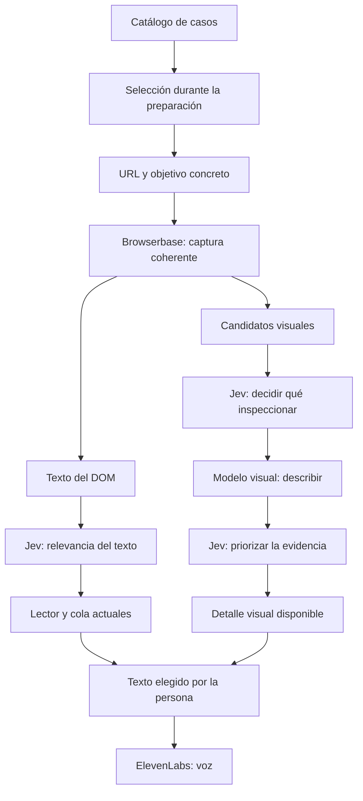

# Actualizar el plan con los casos de demo de Browserbase

Fecha: 26 de septiembre de 2026.
Base revisada: `main`, commit `00f4402`.
Estado: plan preparado para ejecutar en otra sesión.

## Resumen e instrucciones para la sesión ejecutora

Actualizar [IMPLEMENTATION_PLAN.md](./IMPLEMENTATION_PLAN.md) incorporando [use-cases.html](./use-cases.html) como lectura previa obligatoria para quien implemente Browserbase y prepare la demo.

Conservar el plan de integración visual y ElevenLabs, ampliar sus escenarios de demostración y corregir las referencias que quedaron desactualizadas después del pull.

**El entregable de este plan es la actualización de `docs/IMPLEMENTATION_PLAN.md`.** La implementación de Browserbase y ElevenLabs está descrita en ese documento y constituye una etapa posterior. No convertir esta tarea documental en una implementación de servicios o de seis integraciones distintas.

Trabajar en `/Users/jirustaroure/JEVATHON`. Antes de editar:

1. Leer completos `docs/IMPLEMENTATION_PLAN.md` y `docs/use-cases.html`.
2. Confirmar el commit y el estado local. Si hubo nuevos cambios, contrastar las afirmaciones del documento con el código vigente y preservar el trabajo existente.
3. Revisar los puntos del código y de la documentación mencionados en la sección 4.
4. Actualizar el Markdown existente manteniendo su arquitectura, etapas y contratos, con las correcciones y ampliaciones indicadas abajo.

No se necesitan API keys ni llamadas a proveedores para realizar esta actualización documental.

## Configuración disponible para la implementación

Las siguientes variables ya están cargadas en `/Users/jirustaroure/JEVATHON/.env` y se verificó su presencia el 26 de septiembre de 2026:

| Variable | Estado local |
| --- | --- |
| `BROWSERBASE_API_KEY` | Configurada |
| `ELEVENLABS_API_KEY` | Configurada |
| `ELEVENLABS_VOICE_ID` | Configurada |

La próxima sesión puede utilizar esa configuración para implementar y probar los servicios. No es necesario volver a solicitar estos valores salvo que una prueba detecte que falta acceso o que una credencial no es válida. Mantener los valores en `.env`, fuera de Git y del código del cliente; este documento registra únicamente sus nombres y estado.

**Pendiente de comprobar:** autenticación contra las APIs, permisos y créditos disponibles, acceso a la voz elegida y configuración del deployment en Vercel. Tener las variables cargadas no demuestra que las llamadas reales funcionen ni que las integraciones estén implementadas.

## Dónde está la implementación de Browserbase y ElevenLabs

Este archivo complementa el plan técnico con los sitios de demo y las correcciones documentales. El diseño completo de implementación de ambos servicios está en [IMPLEMENTATION_PLAN.md](./IMPLEMENTATION_PLAN.md):

- **Browserbase:** secciones 3 a 6, con arquitectura, captura, selección de elementos visuales mediante Jev, extracción visual, contratos y protección de la lectura.
- **ElevenLabs:** sección 7, con TTS para texto seleccionado, endpoint, reproducción, cancelación y alternativa con voz del navegador. El agente conversacional queda para una fase posterior.
- **Ejecución y validación:** secciones 8 a 10, con archivos, etapas, pruebas y configuración.

Para una sesión cuyo objetivo sea implementar los servicios, leer ambos documentos y el catálogo `use-cases.html`; aplicar las correcciones de este complemento al interpretar el plan técnico. Ejecutar únicamente este archivo corresponde a la actualización documental descrita en el resumen, no a toda la integración.

## 1. Incorporar el documento de referencia

Añadir al comienzo del Markdown una sección **«Documentación que debe leer quien implemente»**, enlazando el catálogo mediante `[Casos de demo](./use-cases.html)`.

Incluir estas instrucciones de forma explícita:

- Leer el catálogo completo antes de elegir páginas, preparar fixtures o implementar la integración Browserbase.
- Utilizar sus objetivos, escenarios y limitaciones como contexto de producto.
- Sus etiquetas «Comprobada» corresponden a las revisiones documentadas allí; no prueban compatibilidad con la futura integración Browserbase.
- Los ejemplos y comportamientos esperados no son funcionalidades ya implementadas ni resultados garantizados de Jev.
- El HTML es documentación para el equipo. No se enviará entero al modelo ni será una dependencia del servidor.
- El contenido de páginas, imágenes y textos alternativos es evidencia a analizar; no puede modificar el objetivo del usuario, las herramientas disponibles ni las reglas del flujo.

Repetir el enlace al catálogo en la sección de demo de Browserbase para que siga visible durante la preparación de pruebas.

## 2. Ampliar la sección Browserbase con los seis escenarios

Añadir la siguiente matriz, manteniendo las URLs originales del catálogo:

| Caso | Objetivo de la persona | Qué probar con Browserbase | Prioridad y limitación |
| --- | --- | --- | --- |
| [Achla Deal](https://achladeal.com/en) | Encontrar un vuelo a Madrid por menos de USD 400 | Capturar ofertas renderizadas; separar información relevante de contadores y promociones. Inspeccionar imágenes solo cuando aporten información ausente del texto | Primera candidata para demo real, siguiendo el catálogo. Revalidar disponibilidad y captura |
| [Dublin Airport](https://www.dublinairport.com/flight-information/live-departures) | Consultar un vuelo concreto según su situación | Extraer estado y puerta entre muchos vuelos; demostrar que el contexto cambia la relevancia | Segunda escena. El número de vuelo del documento es ilustrativo |
| [Dayton Children’s](https://childrensdayton.org/wait-times/) | Consultar disponibilidad del centro al que se dirige | Identificar qué información está en el DOM principal y cuál depende de un iframe | Opcional. El catálogo señala una limitación con MyChart; resolverla queda fuera del MVP visual |
| [BART](https://www.bart.gov/schedules/advisories) | Revisar avisos que afectan el trayecto Embarcadero–SFO | Extraer avisos y evaluarlos con un trayecto conocido proporcionado como contexto | Caso semántico adicional. Usar una fixture para provocar cambios reproducibles |
| [Ticketmaster](https://help.ticketmaster.com/hc/en-us/articles/9642204793617-Why-is-there-a-time-limit-for-checking-out) | Conservar el turno para comprar entradas | Demostrar filtrado de actualizaciones y avisos de tiempo en una réplica controlada | La URL del catálogo es documentación, no una cola operativa. No depender de una compra real |
| [Booking.com](https://www.booking.com/) | Evaluar alojamiento dentro de un presupuesto | Separar precio/disponibilidad de mensajes comerciales; evaluar fotografías únicamente si ayudan al objetivo | Exploración posterior: el catálogo lo marca como pendiente de comprobación |

Estas prioridades provienen del documento aportado; no implican una nueva validación de los sitios.

**Distinción que debe quedar explícita:** Browserbase aporta acceso al DOM renderizado aunque no haga falta visión. Un contador, precio o estado disponible como texto se procesa como texto. La extracción visual se reserva para información que realmente falte.

Añadir estas precisiones junto a la matriz:

- En Achla Deal y Ticketmaster, comparaciones numéricas y umbrales temporales pertenecen al código; Jev evalúa relevancia respecto del objetivo.
- En BART, proporcionar el trayecto conocido como contexto. No pedir al modelo que invente sus estaciones.
- En Dayton, transmitir información logística atribuida al sitio; el escenario no requiere recomendaciones clínicas.
- En Booking, conservar disponibles los mensajes comerciales y no afirmar que sean falsos.
- Las etiquetas `DEFER`, `QUEUE_HIGH` e `INTERRUPT` del catálogo son expectativas que deben evaluarse, no respuestas precargadas que sustituyan a Jev.

## 3. Precisar la arquitectura y la preparación de demos

Ampliar la explicación existente con este recorrido:

Fijar estas decisiones en el documento:

- **Demo real principal:** evaluar primero Achla Deal; Dublin Airport será la segunda candidata.
- **Prueba obligatoria de visión:** conservar la fixture del museo con mapa informativo y banner promocional. Los seis sitios no garantizan por sí mismos un caso visual adecuado.
- **Alternativa reproducible:** usar una fixture identificada como simulación cuando un sitio falle o no cambie durante la presentación. Browserbase necesita una URL accesible desde su navegador remoto; no puede abrir directamente el archivo local del desarrollador.
- **Verificación previa por sitio:** registrar URL final, objetivo, texto capturado, cobertura, candidato visual observado, resultado y limitación encontrada. Una inspección no realizada debe figurar como pendiente.
- **Alcance:** el catálogo no obliga a construir seis integraciones. El MVP mantiene una captura Browserbase acotada; no añade vigilancia permanente, compras ni navegación autónoma.
- **Evidencia:** cifras como «250 cambios → 1 interrupción» deben identificarse como antecedentes del catálogo hasta obtener una medición propia reproducible.

La clasificación de cambios del DOM y la llegada de descripciones visuales seguirán siendo eventos diferentes. Una descripción nueva no disparará automáticamente una interrupción ni reemplazará el texto original.

Mantener dos comprobaciones diferenciadas durante la futura implementación:

1. **Renderizado y clasificación:** capturar una página real, obtener texto útil y clasificarlo con Jev. Puede aprobarse sin realizar llamadas de visión.
2. **Enriquecimiento visual:** observar un mapa o imagen relevante sin equivalente textual suficiente, obtener una descripción identificada como generada y escucharla por elección del usuario, conservando la posición de lectura.

Los escenarios que necesitan cambios temporales reproducibles usarán el flujo de mutaciones existente o una fixture preparada. No convertir la petición acotada de Browserbase en un monitor remoto permanente para reproducirlos.

## 4. Corregir el plan según la codebase actual

Actualizar la base revisada a `00f4402`, o al commit realmente revisado si la siguiente sesión encuentra cambios posteriores. Ajustar las afirmaciones afectadas:

- Reconocer que la app ya incorpora **Analyze/Read, cola, evaluación de cambios, interrupción y reanudación**. La integración debe preservar ese recorrido.
- Conservar el contexto opcional y las decisiones de transición de `/api/rank`; los nuevos visuales no reemplazan ese contrato.
- Reflejar que seleccionar bloques, desplazar la lectura y reanudar también invalidan trabajo mediante `epoch`. Separar la cancelación visual sin eliminar esa protección del contexto de lectura.
- Mantener la distinción entre la demo antigua `FlightLab` y las funciones de interrupción/reanudación que ahora sí existen en el App principal.
- Actualizar la descripción de `docs/DEMO.md`: ya documenta la app actual.
- Reconocer `ReadingQueue` y `BrailleDevice` como superficies existentes. Situar los nuevos detalles visuales respetando las pestañas y la cola compartida.
- Ampliar `.env.example`, que ahora existe, en lugar de proponer crearla. La excepción correspondiente de `.gitignore` también está corregida.
- Registrar las 20 pruebas anteriores como verificación histórica del commit anterior. `docs/VERIFICATION.md` documenta resultados posteriores; atribuirlos al documento y no presentarlos como pruebas ejecutadas en esta revisión.
- Aclarar que el cambio previo del lockfile quedó conservado en un stash. No aplicar ni eliminar ese stash como parte de esta tarea documental.

Revisar estas afirmaciones contra el código vigente antes de editar. No conservar instrucciones obsoletas solo porque estaban en la primera versión del plan.

Mantener los contratos visuales y de audio ya propuestos en el documento principal, con sus invariantes de cancelación, procedencia y conservación de lectura. Esta ampliación del catálogo no introduce endpoints adicionales ni requiere una migración de datos.

## 5. Criterios de aceptación del Markdown

La actualización queda completa cuando:

- El enlace relativo a `use-cases.html` funciona y aparece también en la sección Browserbase.
- Están contemplados los seis sitios, con objetivo, prioridad y limitación.
- Se distingue captura DOM, extracción visual, cambios temporales y simulaciones.
- Existe una demo visual reproducible además de las candidatas reales.
- Las instrucciones preservan cola, interrupción, reanudación y posición de lectura actuales.
- Se mantienen las etapas, claves, controles de audio y pruebas del plan existente.
- Se corrigen los supuestos desactualizados del commit anterior sin atribuir verificaciones nuevas que no se realizaron.
- El diagrama, las tablas y los enlaces del Markdown son legibles y coherentes con el texto.
- Solo se modifica `docs/IMPLEMENTATION_PLAN.md` durante la ejecución de esta tarea. Esta actualización documental no cambia APIs ni implementa las integraciones.

Para validar este trabajo, revisar el documento final y su diff. No hace falta ejecutar builds que regeneren archivos ni llamar a Browserbase, Jev o ElevenLabs. Las pruebas de integración permanecen como pasos de la implementación futura.

Al terminar, informar qué se añadió y enlazar el `IMPLEMENTATION_PLAN.md` actualizado. No afirmar que los sitios fueron probados o que las integraciones están implementadas por haber actualizado el plan.
